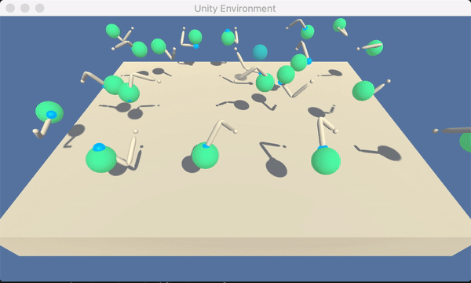

# Udacity-DeepRL-Nanodegree-P2-Continuous-Control
This repository consists of my solution for the second project in Udacity's Deep Reinforcement Learning Nanodegree. 
## Project details
This project makes use of a deep reinforcement learning agent following the DDPG algorithm to solve a Unity environment called Reacher. See [Unity ML-agents](https://github.com/Unity-Technologies/ml-agents) for more details.



In this environment, a double-jointed arm can move to target locations. A reward of +0.1 is provided for each step that the agent's hand is in the goal location. Thus, the goal of the agent is to maintain its position at the target location for as many time steps as possible.

The observation space consists of 33 variables corresponding to position, rotation, velocity, and angular velocities of the arm. Each action is a vector with four numbers, corresponding to torque applicable to two joints. Every entry in the action vector should be a number between -1 and 1.

The environment is considered solved when the agent (in this case all the agents) collects a reward of +30 over 100 consecutive episodes.
## Getting started
The following section was taken from [Udacity's GitHub](https://github.com/udacity/deep-reinforcement-learning#dependencies) for its simple guide on how to get your local machine ready for reinforcement learning with Unity.
You'll need to download the appropriate environment. I am using the 20-agent MacOS version, which can be downloaded [here](https://s3-us-west-1.amazonaws.com/udacity-drlnd/P2/Reacher/Reacher.app.zip).
## Dependencies

To set up your python environment to run the code in this repository, follow the instructions below.

1. Create (and activate) a new environment with Python 3.6.

	- __Linux__ or __Mac__: 
	```bash
	conda create --name drlnd python=3.6
	source activate drlnd
	```
	- __Windows__: 
	```bash
	conda create --name drlnd python=3.6 
	activate drlnd
	```
	
2. Follow the instructions in [this repository](https://github.com/openai/gym) to perform a minimal install of OpenAI gym.  
	- Next, install the **classic control** environment group by following the instructions [here](https://github.com/openai/gym#classic-control).
	- Then, install the **box2d** environment group by following the instructions [here](https://github.com/openai/gym#box2d).
	
3. Clone the repository (if you haven't already!), and navigate to the `python/` folder.  Then, install several dependencies.
```bash
git clone https://github.com/udacity/deep-reinforcement-learning.git
cd deep-reinforcement-learning/python
pip install .
```

4. Create an [IPython kernel](http://ipython.readthedocs.io/en/stable/install/kernel_install.html) for the `drlnd` environment.  
```bash
python -m ipykernel install --user --name drlnd --display-name "drlnd"
```

5. Before running code in a notebook, change the kernel to match the `drlnd` environment by using the drop-down `Kernel` menu.

## Instructions
To run this project on your local machine, clone this repository.
```bash
git clone https://github.com/smejak/Udacity-DeepRL-Nanodegree-P2-Continuous-Control.git
```
Then, open the __Continuous_Control.ipynb__ file and follow the instructions to train your own agent.
